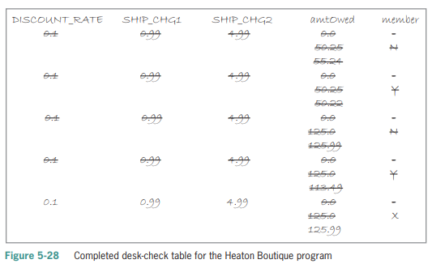
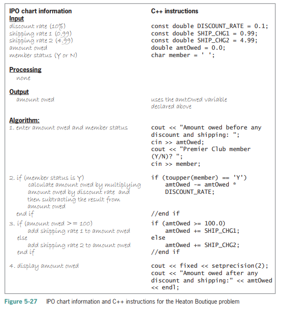

# These assignments directly correspond with assignments in your book. For further details and references, please refer to the approriate sections in your textbook, and if you need further clarification, please reach out.

# Lab 5-2 Plan and Create

1. **Read textbook pages 138 through 142. Note that your book gives instructions for setting up development tools and a development environment. Ignore those instructions. We are using Replit instead. Figure 5-29 on page 142 gives the final C++ instructions to be submitted. Please do not just copy and paste. Working through Lab 5-2 will get you used to developing, building, testing, and pushing/submitting your code**i

2. **Test the program using the same data used to desk-check the program. You can compile and run your code with the following commands:**
```
make clean
make lab5-2
./lab5-2
```
**You can also use the unit test for testing your code by running the following:** 
``` 
make test_lab5-2
./test_files/test_lab5-2
```

3. **When you are done, push your code to the Github classroom. A Github Action will grade your lab.**


# Lab 5-3 Modify

1. **In this lab, you will modify the Heaton Boutique program from Lab 5-2 (code included) to give a 10% discount to members of the store’s Premier Club, and a 5% discount to all other customers. Modify the program instructions appropriately. Use the sample data from Figure 5-28 to test the program. Note that the answers will change slightly from Figure 5-28 because you are adding in a 10% or 5% discount respectively. i.e. if you test 125.0 and No (N), your expected output will be 119.74**



You can run you can compile and run your code with the following commands:

```
make clean
make lab5-3
./lab5-3
```


2. **Test the program using the data in Figure 5-28. You can test your code against my unit test with the following commands:**

``` 
make test_lab5-3
./test_files/test_lab5-3
```

# Lab 5-6 Debug

1. **Read the comments entered at the beginning of the program. Test the program using codes of 1, 2, and 3. Use 100 as the purchase price. Debug the program.**

2. **Test the program using the same data used to desk-check the program. You can compile and run your code with the following commands:**
```
make clean
make lab5-6
./lab5-6
```
**You can also use the unit test for testing your code by running the following:** 
``` 
make test_lab5-6
./test_files/test_lab5-6
```

# Homework 5-12

**A local department store is having a BoGoHo (Buy One, Get One Half Off) sale. The store manager wants a program that allows the salesclerk to enter the prices of two items. The program should calculate and display the total amount the customer owes. The half-off should always be taken on the item having the lowest price. For example, if the items cost $24.99 and $10, the half-off would be taken on the $10 item. If both prices are the same, take the half-off on the second item.**

1. **Create an IPO chart for the problem, and then desk-check the algorithm twice. For the first desk-check, use 24.99 and 10 as the prices. For the second desk-check, use 11.50 and 30.99.**

2. **List the input, processing, and output items, as well as the algorithm, in a chart similar to the one shown earlier in Figure 5-27. Then code the algorithm into a program.**

3. **Desk-check the program using the same data used to desk-check the algorithm.**

4. **Write the C++ instructions necessary in Replit to display the total amount owed in fixed-point notation with two decimal places. Test the program using the same data used to desk-check the program. You can compile and run your code with the following commands:**

```
make clean
make hw5-12
./hw5-12
```
**You can also use the unit test for testing your code by running the following:** 
``` 
make test_hw5-12
./test_files/test_hw5-12
```

